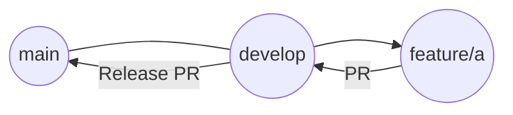

# Development Workflow

We follow the **Gitflow** workflow for development. This ensures a structured approach to feature development, testing, and deployment.

## Branching Strategy

### 1. Main Branches
- **`main`**: The production-ready branch. Contains the stable code that is deployed.
- **`develop`**: The integration branch. All new features are merged here first for testing.

### 2. Supporting Branches
- **`feature/*`**: Used for developing new features.
    - Naming convention: `feature/feature-name` (e.g., `feature/auth-login`)
    - Created from: `develop`
    - Merged into: `develop`

## Workflow Steps

### 1. Start a New Feature
When starting a new task (e.g., "Feature A"):
1.  Checkout the `develop` branch and pull the latest changes.
    ```bash
    git checkout develop
    git pull origin develop
    ```
2.  Create a new feature branch.
    ```bash
    git checkout -b feature/a
    ```

### 2. Develop and Commit
- Write code, run tests, and commit your changes.
- Keep commits atomic and descriptive.

### 3. Submit a Pull Request (PR)
1.  Push your feature branch to the remote repository.
    ```bash
    git push origin feature/a
    ```
2.  Open a Pull Request (PR) from `feature/a` to **`develop`**.
3.  Request review and address any feedback.

### 4. Merge to Develop
- Once the PR is approved, it is merged into `develop`.
- This updates the development environment with the new feature.

### 5. Release (Merge to Main)
- When `develop` is stable and ready for release:
    1.  Create a Pull Request from `develop` to **`main`**.
    2.  After merging, tag the release (optional but recommended).
    3.  Deploy from `main`.

## Summary Diagram


